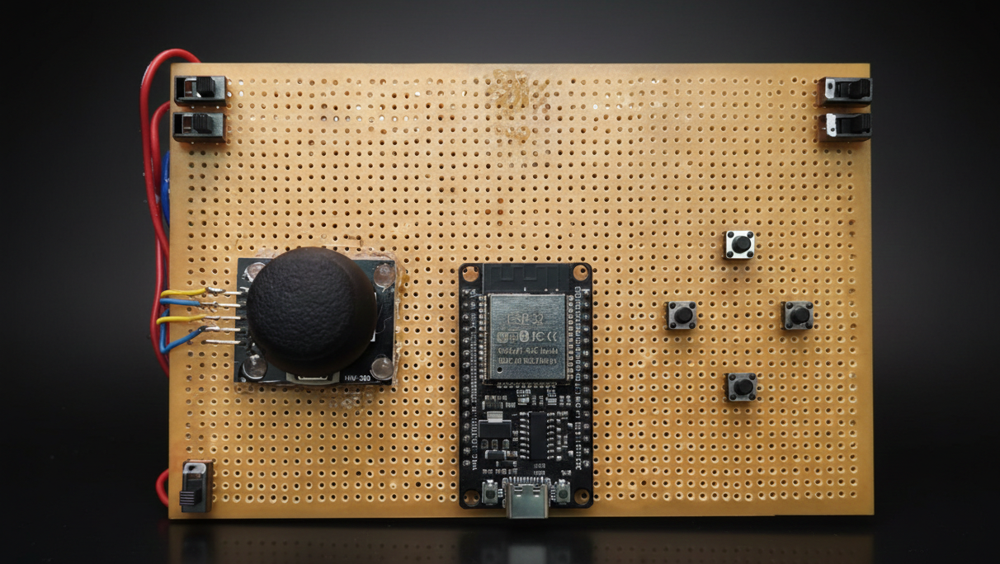
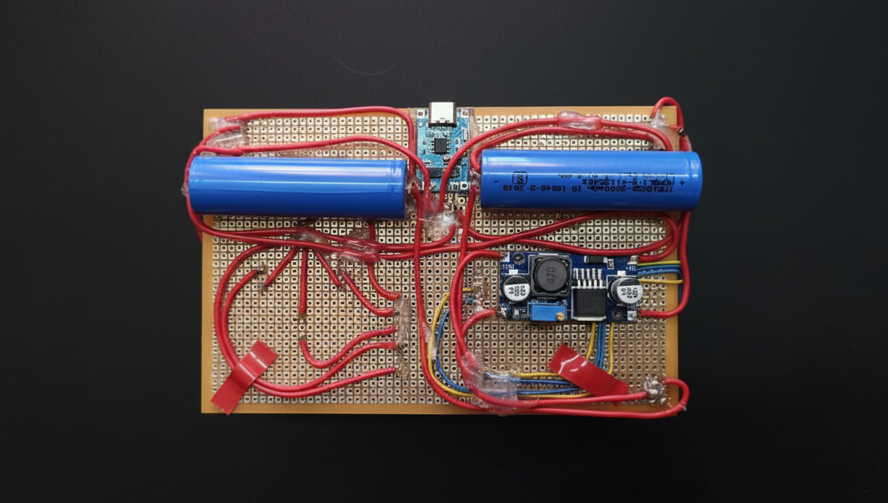
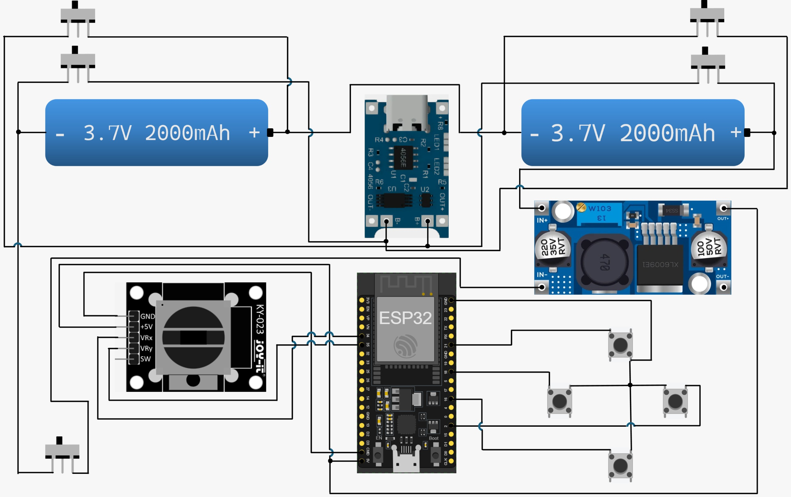

# esp32-wifi-controller
ESP32-based Wi-Fi controller that sends input commands to a PC via a Python server bridge.
## Overview
This project is a hardware–software controller built using an ESP32 and a Python server to remotely send input commands to a computer over Wi-Fi.

The ESP32 connects to the same Wi-Fi hotspot as the target laptop/PC and transmits control data. A Python server running on the computer receives these commands and translates them into system inputs.

The project was developed as an embedded systems experiment combining networking, hardware integration, and software control.

---
### Controller

### Circuit Diagram

## System Architecture

ESP32 Controller  
→ Wi-Fi Hotspot (common network bridge)  
→ Python Server (PC)  
→ Input Execution on Host System

The hotspot acts only as a communication bridge. No internet connection is required.

---

## Features
- ESP32-based wireless controller
- Real-time command transmission over Wi-Fi
- Python backend for input handling
- Modular separation between hardware and software
- Low-latency local network communication

---

## Hardware Used
- ESP32 development board
- Custom wired controller inputs (buttons/switches)
- Laptop/PC running Python
- Wi-Fi hotspot (phone or router)

---

## Software Components

### ESP32 Firmware
Located in `/esp32/`

Responsible for:
- Reading hardware inputs
- Connecting to Wi-Fi network
- Sending control signals to the server

Built using Arduino framework for ESP32.

---

### Python Server
Located in `/server/`

Responsible for:
- Listening for incoming ESP32 commands
- Processing received data
- Triggering system input actions

Requires Python 3.

---
